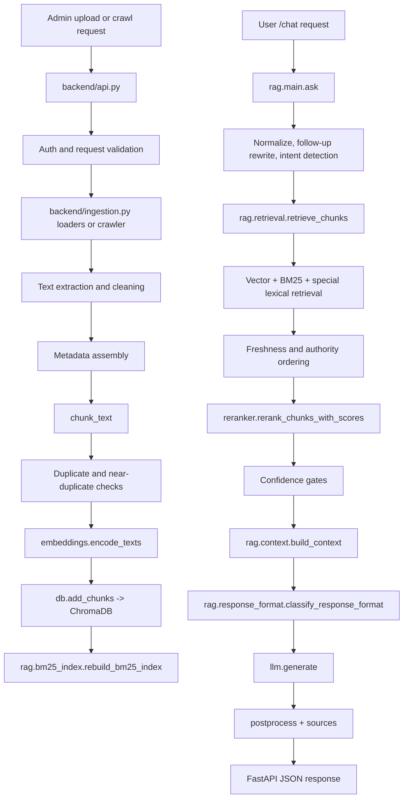

# EduBot Backend RAG Workflow and File-by-File Architecture Analysis

This document is based on the current backend implementation under `backend/`. It describes what the code actually does today, including a few implementation quirks that matter for debugging and maintenance.

## 1. High-Level Backend Workflow

### End-to-end flow

```text
Admin uploads document or starts website crawl
        ↓
FastAPI endpoint in backend/api.py receives request
        ↓
Admin access validation for write operations
        ↓
File loader or website crawler in backend/ingestion.py
        ↓
Text extraction, cleaning, metadata shaping
        ↓
Structure-aware chunking
        ↓
Exact and near-duplicate filtering
        ↓
Embedding generation with SentenceTransformer
        ↓
ChromaDB storage of chunk text + embedding + metadata
        ↓
BM25 index rebuild from ChromaDB
        ↓
User sends question to /chat
        ↓
Query normalization, follow-up rewriting, intent detection
        ↓
Hybrid retrieval: vector + BM25 + special lexical retrieval
        ↓
Custom score fusion and freshness/authority ordering
        ↓
Cross-encoder reranking
        ↓
Confidence gates / not-found guards
        ↓
Context construction + response-format classification
        ↓
LLM prompt generation
        ↓
LLM answer generation
        ↓
Post-processing, source packaging, JSON response
        ↓
Frontend chat UI renders answer and structured sources
```

### Mermaid flowchart



Important correction: the current code does not implement Reciprocal Rank Fusion. It uses custom score fusion in `backend/rag/retrieval.py`, then freshness and authority ordering in `backend/rag/freshness.py`, then cross-encoder reranking in `backend/reranker.py`.

## 2. Backend Entry Points and API Layer

### Main entry

- Main API file: `backend/api.py`
- Legacy UI file: `backend/app.py` is a Streamlit client, not the production backend API.
- FastAPI startup loads:
  - env vars via `load_dotenv()`
  - upload directory setup
  - CORS middleware
  - embedding model on startup
  - cross-encoder on startup
  - BM25 index freshness check and rebuild if Chroma count differs

### Middleware and startup behavior

- CORS: `fastapi.middleware.cors.CORSMiddleware`
- Allowed origins:
  - `ALLOWED_ORIGINS`
  - `ALLOWED_ORIGIN_REGEX`
  - fallback includes `http://localhost:5173`
- Startup event:
  - `embeddings.get_embedding_model()`
  - `reranker._get_cross_encoder()`
  - `rag.bm25_index.load_bm25_index()` and conditional `rebuild_bm25_index()`

### Authentication and admin validation

- Read-only `/chat` has no auth requirement.
- Upload, crawl, delete, admin endpoints call `ensure_admin_access()`.
- Admin validation path:
  - `require_bearer_token()`
  - `fetch_current_user()` via Supabase Auth REST
  - `fetch_profile_role()` via Supabase `profiles` table
  - allowed roles: `admin`, `super_admin`

### Endpoint map

| File | Endpoint / Function | Purpose | Input | Output |
| --- | --- | --- | --- | --- |
| `backend/api.py` | `GET /auth/profile-role` | Resolve current user role | Bearer token | `{id,email,role}` |
| `backend/api.py` | `POST /chat` | Run RAG pipeline | `ChatRequest` | RAG response JSON |
| `backend/api.py` | `POST /upload` | Upload and ingest file | multipart file + metadata | upload stats |
| `backend/api.py` | `POST /crawl-website` | Synchronous crawl+ingest | `WebsiteCrawlRequest` | crawl stats |
| `backend/api.py` | `POST /crawl/start` | Background crawl job | `WebsiteCrawlRequest` | `{job_id,status}` |
| `backend/api.py` | `GET /crawl/status/{job_id}` | Job status | job id | crawl job JSON |
| `backend/api.py` | `POST /crawl/control/{job_id}` | pause/resume/skip/cancel | action | success JSON |
| `backend/api.py` | `GET /crawl/jobs` | List jobs | auth header | list of jobs |
| `backend/api.py` | `DELETE /crawl/{job_id}` | Delete job record | job id | success JSON |
| `backend/api.py` | `POST /admin/debug/search` | Retrieval debugging | query + top_k | debug retrieval data |
| `backend/api.py` | `GET /documents` | List local/vector-known docs | none | filenames |
| `backend/api.py` | `GET /documents/{filename}/download` | Download source file | filename | file stream |
| `backend/api.py` | `DELETE /documents/all` | Delete all docs/chunks/files | auth header | deletion stats |
| `backend/api.py` | `DELETE /documents/{filename}` | Delete one document | filename | deletion stats |
| `backend/api.py` | `POST /websites/delete` | Delete website chunks by normalized base URL | URL | deletion stats |

### Chat request/response schema

Request model in `backend/api.py`:

```json
{
  "query": "What courses are offered?",
  "question": null,
  "history": "optional string or [{role,content}]",
  "system_prompt": null,
  "temperature": null,
  "top_k": null
}
```

Response shape from `backend/rag/schemas.py`:

```json
{
  "answer": "text",
  "sources": [],
  "suggested_questions": [],
  "retrieval_query": "normalized query used for retrieval",
  "used_history": false,
  "response_type": "rag | not_found | clarification | error | ..."
}
```

## 3. Ingestion Workflow

### 3.1 Supported file types

Supported extensions are defined in `backend/ingestion.py` as `SUPPORTED_EXTENSIONS`.

| File Type | Loader / Library | Extraction Method | OCR Used | Processing File |
| --- | --- | --- | --- | --- |
| PDF | `pdfplumber` | page text + table extraction | OCR fallback per page if text is too short | `backend/ingestion.py` |
| DOCX | `python-docx` | paragraph concatenation | No | `backend/ingestion.py` |
| TXT | `langchain_community.TextLoader` | raw text load | No | `backend/ingestion.py` |
| HTML / HTM | `BeautifulSoup` | visible text after removing nav/footer/header/script/style | No | `backend/ingestion.py` |
| CSV | `pandas` | dataframe to text | No | `backend/ingestion.py` |
| Markdown | `TextLoader` | raw markdown text | No | `backend/ingestion.py` |
| JSON | stdlib `json` | pretty-printed JSON text | No | `backend/ingestion.py` |
| XLSX / XLS | `pandas` | sheet-by-sheet dataframe extraction | No | `backend/ingestion.py` |
| SQL / DUMP | custom file loader | plain text | No | `backend/ingestion.py` |
| PNG / JPG / JPEG / WebP | `Pillow` + `pytesseract` | OCR text extraction | Yes, always | `backend/ingestion.py` |

### 3.2 File validation

Upload validation in `backend/api.py`:

- file name required
- extension must be in `SUPPORTED_EXTENSIONS`
- `Path(file.filename).name` strips path traversal input
- file bytes are written to `backend/data/uploads/<filename>`
- failed ingest removes the just-written local file
- upload route requires admin access

What is not implemented in the current code:

- no explicit MIME validation
- no explicit max upload size check
- no rename-on-collision logic; same filename is overwritten locally

### 3.3 Text extraction details

#### PDF

Implemented by `load_pdf_bytes()` in `backend/ingestion.py`.

- opens with `pdfplumber.open(io.BytesIO(file_bytes))`
- per page:
  - extracts prose with `page.extract_text()`
  - extracts tables with `page.extract_tables()`
  - converts tables via `_table_to_text()`
  - cleans each component with `clean_loaded_text()`
- OCR fallback triggers when page text after table merge has fewer than `PDF_OCR_FALLBACK_MIN_WORDS = 20`
- OCR path:
  - `page.to_image(resolution=200).original`
  - `run_ocr_on_image()`
- preserves:
  - `page`
  - `total_pages`
  - `section_title`
  - `tables_extracted`
  - `ocr_used`
  - `document_year`
  - `document_date`
  - `is_toc`
- repeated page boilerplate is removed after page extraction by `strip_repeated_pdf_boilerplate()`

#### Images

Implemented by `load_image_bytes()` in `backend/ingestion.py`.

- skips obvious decorative filenames/URLs containing `logo`, `icon`, `avatar`
- skips small images:
  - width `< 400`
  - height `< 300`
  - area `< 120000`
- OCR is always used for accepted images
- empty OCR result is dropped

#### DOCX / TXT / HTML / CSV / Markdown / JSON / Excel

All are converted into text `Document` objects, then passed through the same cleaning, section-title detection, chunking, dedupe, embedding, and storage path.

### 3.4 Main ingestion files and responsibilities

#### File: `backend/ingestion.py`

Purpose:
- file loading
- website crawling
- text cleaning
- chunking
- metadata creation
- duplicate detection
- embedding orchestration
- Chroma write orchestration
- cache invalidation
- BM25 rebuild

Important functions:

| Function | Parameters | Processing | Return |
| --- | --- | --- | --- |
| `load_file_from_bytes` | bytes, filename | route to file-type-specific loader | `list[Document]` |
| `load_pdf_bytes` | bytes, filename | PDF extraction + OCR fallback | `list[Document]` |
| `load_website` | crawl params | Crawl4AI first, legacy fallback | `list[Document]` |
| `chunk_text` | text, max_length, overlap | structure-aware chunking | `list[str]` |
| `ingest_documents` | documents + metadata fields | metadata, dedupe, embed, store | stats dict |
| `ingest_file_bytes` | file bytes + metadata | load + ingest | stats dict |
| `ingest_website` | URL + crawl options | crawl + ingest | stats dict |

Execution flow:

```text
ingest_file_bytes / ingest_website
    ↓
load_file_from_bytes / load_website
    ↓
clean_loaded_text + metadata helpers
    ↓
chunk_text
    ↓
dedupe + metadata normalize
    ↓
encode_texts
    ↓
db.add_chunks
    ↓
cache.invalidate_on_ingestion
    ↓
rebuild_bm25_index
```

#### File: `backend/db.py`

Purpose:
- initialize persistent ChromaDB collection
- normalize metadata
- generate stable chunk IDs and text hashes
- add/delete/restore chunk helpers

Key storage config:

- collection name: `edubot_docs`
- path: `backend/chroma_db`
- distance space: cosine

#### File: `backend/embeddings.py`

Purpose:
- load shared embedding model
- encode chunks
- encode queries with BGE query prefix

#### File: `backend/rag/bm25_index.py`

Purpose:
- rebuild/load/store BM25 index on disk
- lexical retrieval over stored chunk texts

#### File: `backend/rag/cache.py`

Purpose:
- response cache
- retrieval cache
- cache invalidation on ingestion

## 4. Website Crawling Workflow

### Request path

Two entry patterns exist:

- synchronous: `POST /crawl-website` -> `ingest_website()`
- background job: `POST /crawl/start` -> `create_crawl_job()` -> thread -> `run_crawl_background()` -> `ingest_website()`

### Crawl execution

Primary crawler:

- `backend/ingestion.py::load_website()`
- attempts `crawl4ai_crawler.crawl_with_crawl4ai()`

Fallback crawler:

- `backend/ingestion.py::load_website_legacy()`

Legacy crawler behavior includes:

- URL normalization: `normalize_url()`
- domain lock:
  - `is_private_ip()`
  - `is_domain_allowed()`
  - optional `same_domain_only`
- robots handling via `RobotFileParser`
- extension/path filtering
- per-URL exclusion through `crawler.is_excluded_url()`
- queue with `(url, depth)`
- maximums:
  - `max_pages`
  - `max_pdfs`
  - `max_depth`
- document and PDF discovery
- HTML visible text extraction
- PDF/doc download and handoff to file/document loaders
- pause/resume/cancel/skip control via crawl-job flags

### Crawl job management

Implemented in `backend/ingestion.py`.

- in-memory store: `crawl_jobs`
- local persistence: `backend/data/crawl_jobs.json`
- optional Supabase sync to `crawl_jobs` table
- controls supported:
  - `skip_current_page`
  - `skip_current_document`
  - `pause`
  - `resume`
  - `cancel`

### Re-crawl duplicate behavior

Reprocessing is reduced by:

- normalized URL handling
- `visited` set during crawl
- source-level dedupe in `ingest_documents()`
  - compares against existing chunk `text_hash` values for the same `crawl_base_url`
- orphan cleanup deletes old chunks that are no longer present in the newly crawled source set

Important note: this is chunk-content dedupe, not a persisted page-fetch cache. The crawler may revisit a page, but unchanged chunks are skipped at ingest time.

## 5. Text Cleaning and Normalization

Primary cleaning function: `clean_loaded_text()` in `backend/ingestion.py`

| Cleaning Step | Function | File | Reason |
| --- | --- | --- | --- |
| Null-byte removal | `clean_loaded_text` | `backend/ingestion.py` | remove corrupt binary residue |
| Ligature normalization | `normalize_ligatures` | `backend/rag/text_utils.py` | fix OCR/PDF ligatures |
| Mixed-case PDF term repair | `repair_pdf_mixed_case_terms` | `backend/ingestion.py` | correct broken casing in extracted PDF text |
| Hyphenated line repair | regex `(\w)-\n(\w)` | `backend/ingestion.py` | join split words |
| Newline normalization | `clean_loaded_text` | `backend/ingestion.py` | unify line endings |
| Standalone page-number removal | regexes | `backend/ingestion.py` | reduce boilerplate |
| Common header/footer removal | regexes | `backend/ingestion.py` | remove repeated institutional boilerplate |
| Space collapse | regexes | `backend/ingestion.py` | cleaner chunk text |
| Repeated PDF boilerplate stripping | `strip_repeated_pdf_boilerplate` | `backend/ingestion.py` | remove repeated running lines across pages |
| Website hidden element removal | `is_hidden_html_element` and HTML extraction helpers | `backend/ingestion.py` | remove hidden/decorative HTML |

Website cleaning additionally removes:

- `nav`
- `footer`
- `header`
- `aside`
- `script`
- `style`

## 6. Metadata Extraction

Metadata is assembled in `ingest_documents()` and normalized in `db.normalize_metadata()`.

### Core metadata fields present in the project

| Field | Created In | Used During |
| --- | --- | --- |
| `filename` | ingestion + db defaults | citations, deletion, retrieval |
| `source_filename` | ingestion | source identity |
| `page` / `page_label` / `total_pages` | loaders | citations, debugging |
| `chunk_index` | `ingest_documents()` | citations, dedupe |
| `section_title` / `heading` / `section_heading` | loaders + ingest | retrieval, rerank text |
| `document_type` | request + authority classifier | filters, authority |
| `department` | request | filters |
| `year` | request | filters |
| `file_type` / `doc_type` | loaders + ingest | source handling |
| `source_type` | loaders + ingest | freshness/source priority |
| `source_url` | website loaders | citations, crawl identity |
| `found_on_url` | website loaders | crawl provenance |
| `source_pdf_filename` | website PDF path | citations/debugging |
| `crawl_base_url` | website ingest | per-site dedupe and deletion |
| `crawl_timestamp` | loaders/ingest | freshness |
| `document_year` | loaders/ingest | freshness |
| `document_date` | loaders/ingest | freshness |
| `scope` | request | official/personal access control |
| `user_id` / `session_id` | ingest | personal-doc isolation |
| `deleted` / `status` | ingest/db | active filtering |
| `word_count` / `text_chars` | ingest | quality/debugging |
| `text_hash` | ingest | dedupe |
| `is_toc` | loaders/ingest | TOC suppression |
| `ocr_used` | PDF/image loaders | debugging |
| `tables_extracted` | PDF loader | debugging |
| `priority_level` / `authority_score` / `hostel_type` / `display_name` / `version` | `rag.authority.classify_document()` | authority ranking and citations |

Implementation quirk:

- if `document_year` is missing, `ingest_documents()` currently defaults it to `2026`
- if `document_date` is missing, it defaults to `2026-06-12`

That is not inferred behavior; it is hard-coded in the current ingestion path and affects freshness ranking.

## 7. Chunking Workflow

Chunking function: `chunk_text()` in `backend/ingestion.py`

Actual settings:

- default chunk size: `MAX_CHARS_PER_CHUNK = 1500`
- list chunk size: `MAX_CHARS_PER_LIST_CHUNK = 1500`
- overlap: `CHUNK_OVERLAP = 150`
- minimum chunk words: `MIN_CHUNK_WORDS = 6`
- list/table margin factor: `CHUNK_MARGIN_FACTOR = 1.5`

Behavior:

- cleans text first
- detects whether the whole text is list-heavy
- splits content into structural blocks:
  - heading
  - table
  - list
  - paragraph
- preserves tables/lists up to `limit * CHUNK_MARGIN_FACTOR`
- falls back to `RecursiveCharacterTextSplitter` for oversized single blocks
- computes char offsets later in `ingest_documents()`

Example flow:

```text
Raw extracted page text
    ↓
clean_loaded_text
    ↓
block detection: heading / table / list / paragraph
    ↓
chunk assembly with overlap
    ↓
chunk metadata: page, section_title, chunk_index, char_start, char_end
```

## 8. Duplicate Detection

Implemented mainly in `ingest_documents()`.

### Exact duplicate logic

- existing comparison scope:
  - `filename` for uploaded docs
  - `crawl_base_url` for website ingest
- existing chunk metadata is read from Chroma
- exact dedupe key uses:
  - chunk text
  - metadata JSON except `ingested_at` and `crawl_timestamp`
  - SHA-256 truncated to 24 chars -> `text_hash`

### Near-duplicate logic

- SimHash-based near-duplicate guard within the current ingest run
- threshold: `SIMHASH_NEAR_DUP_MAX_HAMMING = 3`
- protected by `digit_signature` bucketing so chunks with different numbers are not merged

### Re-ingest outcomes

1. Same file uploaded twice, unchanged:
   unchanged chunks are skipped as duplicates.
2. Same file name, changed content:
   new chunks are added; orphaned old chunks for that file are deleted.
3. Website page crawled again, unchanged:
   chunks are skipped by `text_hash`.
4. Website page crawled again, updated:
   changed chunks are inserted; removed old chunks are deleted as orphans.
5. Small crawl followed by larger crawl:
   same-site dedupe is based on `crawl_base_url`, so previously-seen unchanged chunks remain skipped while new content is added.

## 9. Embedding Workflow

Embedding file: `backend/embeddings.py`

- model env var: `EMBEDDING_MODEL`
- default model: `BAAI/bge-base-en-v1.5`
- query prefix: `Represent this sentence for searching relevant passages: `
- local-files-only behavior: `MODEL_LOCAL_FILES_ONLY`, default `true`
- batch encoding: `encode_texts(..., batch_size=64)` by default
- embeddings normalized when supported: `normalize_embeddings=True`

Device handling:

- detects CUDA or MPS
- currently still loads SentenceTransformer with `device="cpu"` explicitly
- printed message says CPU as well

What gets embedded:

| Content | Embedded? | Stage | Stored Where |
| --- | --- | --- | --- |
| chunk text from uploaded docs | Yes | ingestion | ChromaDB |
| chunk text from crawled website pages | Yes | ingestion | ChromaDB |
| chunk text from website PDFs/docs | Yes | ingestion | ChromaDB |
| OCR-extracted text chunks | Yes | ingestion | ChromaDB |
| user query | Yes | retrieval | transient, used for Chroma query |
| raw files | No | never | not embedded directly |

Embedding call chain:

```text
ingest_documents
    ↓
embedding_text = title + source + section + chunk
    ↓
encode_texts
    ↓
db.add_chunks
```

## 10. Database and Storage Architecture

### 10.1 Local file storage

- uploaded source files: `backend/data/uploads/`
- crawl job persistence: `backend/data/crawl_jobs.json`
- response cache: `backend/data/response_cache.json`
- retrieval cache: `backend/data/retrieval_cache.json`
- BM25 index: `backend/data/bm25_index.pkl`

### 10.2 ChromaDB

Configured in `backend/db.py`.

- path: `backend/chroma_db`
- collection: `edubot_docs`
- stores:
  - chunk `document`
  - embedding vector
  - metadata
  - chunk `id`

Similarity search:

- `collection.query(query_embeddings=[...], n_results=..., include=["documents","metadatas","distances"])`

### 10.3 PostgreSQL / Supabase

The current project uses Supabase REST for:

- auth user lookup
- `profiles`
- `admin_invites`
- `admin_activity_logs`
- optional `crawl_jobs` sync

The current code does not store vector embeddings in Supabase/PostgreSQL.

### 10.4 Cache storage

| Storage Layer | What It Stores | Main File | Read By | Written By |
| --- | --- | --- | --- | --- |
| ChromaDB | embeddings, chunk text, chunk metadata | `backend/db.py` | retrieval, debug, delete | ingestion |
| BM25 pickle | lexical model + docs + metas | `backend/rag/bm25_index.py` | BM25 retrieval | startup, ingestion |
| Response cache | final answers | `backend/rag/cache.py` | `rag.main.ask` | `rag.main.ask` |
| Retrieval cache | ranked retrieval results | `backend/rag/cache.py` | retrieval layer | retrieval layer |
| Crawl job JSON | crawl progress state | `backend/ingestion.py` | crawl APIs | crawl APIs |

## 11. User Query and Chat Request Flow

Route: `POST /chat` in `backend/api.py`

Flow:

1. choose `query` or `question`
2. reject empty query
3. normalize history with `format_chat_history()`
4. call `rag.ask(...)`

Inside `rag.main.ask()`:

1. build cache scope
2. normalize query
3. response-cache lookup
4. call `_ask_internal()`
5. cache successful non-error result

Early guards in `_ask_internal()`:

- personal-record refusal
- homework refusal
- casual greeting reply
- out-of-scope refusal

## 12. Conversation Context and Follow-Up Resolution

Implemented in `backend/rag/query_expansion.py`.

Key functions:

- `is_followup_query()`
- `get_last_real_user_question()`
- `get_last_assistant_response()`
- `rewrite_contextual_followup()`
- `build_smart_query()`

Behavior:

- accepts chat history as a single formatted string
- rewrites short follow-ups into a standalone retrieval query when needed
- returns:
  - rewritten retrieval text
  - latest user request
  - `used_history` flag

The rewritten retrieval query, not the raw short follow-up, is what the retrieval layer uses.

## 13. Intent Detection and Query Processing

Implemented primarily in `backend/rag/intent.py`.

Examples of supported intent families:

- admission / eligibility
- fees / application fee / fee table
- departments
- courses / programmes / certificate / postgraduate
- contact
- clubs / committees / activities
- hostel / warden
- staff / person lookup / role lookup
- attendance
- document overview
- procedural queries
- casual / out-of-scope / homework

Important helpers:

- `detect_query_intents()`
- `get_primary_intent()`
- `extract_entities()`
- `extract_role_query()`
- `detect_programme()`
- `classify_admission_query()`

## 14. Retrieval Workflow

Main orchestrator: `backend/rag/retrieval.py`

### 14.1 Semantic retrieval

Function: `vector_retrieve_chunks()`

- query embedding: `embeddings.encode_query()`
- vector store query: ChromaDB
- candidate count: `max(top_k, RETRIEVAL_CANDIDATES)`
- `RETRIEVAL_CANDIDATES = 30`
- distance metric: cosine in Chroma collection

### 14.2 Keyword retrieval

Functions:

- `keyword_retrieve_chunks()`
- `special_list_keyword_retrieve()`
- BM25 provider: `rag.bm25_index.bm25_retrieve()`
- BM25 candidate count:
  - normal: up to 300 raw BM25 candidates
  - list queries: up to 500 raw BM25 candidates
- configured keyword limit: `KEYWORD_CANDIDATES = 50`

### 14.3 Fusion

RRF is not implemented.

Actual fusion path:

1. vector retrieval
2. keyword retrieval
3. optional special lexical retrieval
4. dedupe by candidate key
5. `rerank_results()` applies custom score formula:
   - lexical score
   - vector score
   - metadata boost
   - domain-specific evidence scores
   - intent score

### 14.4 Metadata filtering

Filter builder: `rag.filters.build_filter()`

Supported filter dimensions:

- personal vs official scope
- `user_id`
- `department`
- `year`
- `document_type`
- active/deleted checks via `metadata_allows_query()`

### 14.5 Special retrieval rules

The retrieval layer has custom handling for:

- staff queries
- HOD / head queries
- contact queries
- attendance queries
- fee queries
- course and department lists
- club/cell/committee queries
- hostel and procedural queries
- person lookup queries
- website links queries

## 15. Freshness and Document-Authority Scoring

Freshness file: `backend/rag/freshness.py`

Authority file: `backend/rag/authority.py`

### Freshness logic

- valid year range: `1900` to `current year + 1`
- metadata year preferred over body-text year
- historical prose is prevented from earning recency boosts
- `freshness_score()`:
  - base `year * 100`
  - parsed document date timestamp contribution
  - crawl timestamp contribution

### Authority logic

Tier-1 hierarchy derived by filename patterns:

- boys hostel prospectus
- girls hostel prospectus
- handbook
- prospectus

Authority outputs:

- `priority_level`
- `authority_score`
- `document_type`
- `category`
- `hostel_type`
- `display_name`

Ranking in `freshness_rank_items()` uses this tuple:

1. semantic relevance band
2. authority rank
3. source priority
4. freshness
5. relevance

Important source priorities:

- `pdf`: 100
- `upload`: 100
- `website`: 100
- `website_image`: 35
- `website_links`: 20
- fallback: 25

Conflict handling:

- `drop_superseded_duplicates()` removes older near-duplicate versions of the same topic when year and similarity checks support it.

## 16. Cross-Encoder Reranking

File: `backend/reranker.py`

- feature flag: `USE_CROSS_ENCODER_RERANKER`
- default model: `BAAI/bge-reranker-base`
- local-files-only supported
- reranker input text is shortened with `rag.text_utils.rerank_text()[:1800]`
- returns sigmoid probabilities from raw cross-encoder scores

Fallback behavior:

- if model disabled or unavailable, a local token/distance scoring fallback is used
- fallback probabilities are uniform `0.5`
- `rag.main` then applies a hard vector-distance gate if reranker is unavailable

Important thresholds:

- reranker low-score block: `MIN_RERANKER_SCORE = 0.1`
- confidence threshold: `CONFIDENCE_THRESHOLD = 0.25`

## 17. Context Construction

File: `backend/rag/context.py`

Function: `build_context()`

Context limits:

- default: `MAX_CONTEXT_CHARS = 8000`
- list/document overview: `LIST_QUERY_CONTEXT_CHARS = 8000`
- fee table queries: `FEE_TABLE_CONTEXT_CHARS = 18000`

Per-chunk character limits vary by query type:

- fee table / warden / certificate: up to `2600`
- staff / committee / head: up to `2200`
- list/activity/document overview: up to `1800`
- otherwise `1500`

The builder:

- drops weak far-distance chunks when evidence is low
- suppresses TOC-like chunks
- anchors chunk excerpt around query-relevant spans using `focus_text_for_query()`
- emits a structured source header for each chunk
- preserves provenance fields for citations:
  - file
  - page
  - section
  - source URL
  - source type
  - document year/date

## 18. Response-Format Selection

File: `backend/rag/response_format.py`

This stage is deterministic and runs before LLM generation.

Possible formats:

- `paragraph`
- `bullets`
- `numbered_list`
- `table`
- `mixed`

Table selection only happens when the retrieved context appears to contain enough structured records. That is the project’s main anti-fabrication safeguard for tabular answers.

## 19. Prompt Construction

Prompt files:

- system prompt constant: `backend/rag/config.py` as `EDUBOT_ANSWER_SYSTEM_PROMPT`
- public import alias: `backend/rag/prompts.py` as `LLM_SYSTEM`

User prompt template:

```text
Question: {query}

Context:
---
{context}
---
```

System prompt rules include:

- answer only from supplied context
- use exact values for names, dates, amounts, codes
- do not cite filenames inline
- prefer higher-authority/newer sources when conflicts exist
- return exact not-found sentinel when context lacks the answer

## 20. LLM Answer Generation

File: `backend/llm.py`

Supported providers:

| Provider | Default Model | Config Notes |
| --- | --- | --- |
| `ollama` | `llama3.2:3b` | local `/api/chat`, non-streaming |
| `groq` | `llama-3.3-70b-versatile` | OpenAI-compatible chat completions |
| `openrouter` | `openai/gpt-oss-120b:free` | OpenAI-compatible chat completions |
| `gemini` | `gemini-1.5-flash` | direct Google API |
| `anthropic` | `claude-sonnet-4-6` | direct Anthropic Messages API |

Behavior:

- provider selected by `LLM_PROVIDER`
- temperature clamped to `0.0..1.0`
- non-streaming for all current implementations
- retry wrapper handles 429 and 5xx backoff

Important runtime handling in `rag.main.call_llm_with_retry()`:

- response cache is checked if a rate-limit error occurs
- if cache hit, cached answer is returned with `(cached response)`
- else a temporary busy message is returned

## 21. Grounding and Hallucination Prevention

The current system uses several layers:

- official/personal scope filtering
- query intent gating
- programme availability gate
- confidence thresholds before LLM call
- hard distance gate when reranker is unavailable
- context-only system prompt
- authority/freshness ranking
- TOC suppression
- not-found fallback response
- post-generation token faithfulness logging

Primary not-found text source:

- `NOT_FOUND_MESSAGE` in `backend/rag/config.py`

## 22. Answer Validation and Source Citations

Current behavior after generation:

- `postprocess_answer()` in `backend/rag/text_utils.py`
- `append_supporting_action_details()` may enrich some responses
- source list is returned separately from answer text
- source ranking/deduping handled by `rank_sources_for_query()`

The response object today does not include explicit `intent` or `format` fields. Those are internal decisions, not part of the API response schema.

## 23. Cache Workflow

File: `backend/rag/cache.py`

### Layer 1: response cache

- file: `backend/data/response_cache.json`
- key: SHA-256 of normalized query + history signature + scope signature
- TTL: `86400` seconds

### Layer 2: retrieval cache

- file: `backend/data/retrieval_cache.json`
- key: normalized query + intent label
- TTL: `3600` seconds

### Invalidation

Current invalidation trigger:

- `invalidate_on_ingestion()` after successful ingest

That clears response and retrieval caches so new documents are immediately searchable and answerable.

## 24. Deletion and Update Workflow

### Document deletion

Endpoints:

- `DELETE /documents/{filename}`
- `DELETE /documents/all`
- `POST /websites/delete`

Behavior:

- admin auth required
- deletes Chroma chunks
- deletes local uploaded file when applicable
- website delete removes chunks by normalized URL

Important limitation:

- delete endpoints do not explicitly rebuild BM25 or clear RAG caches afterward in `api.py`, so lexical/index/cache consistency after deletion depends on current runtime state and may require follow-up maintenance.

### Document replacement/update

There is no explicit “update” endpoint. Replacement happens through re-ingestion:

- same source -> new chunks stored
- missing old chunks deleted as orphans

## 25. Configuration and Environment Variables

Key variables present in the codebase:

| Variable | Used In | Purpose |
| --- | --- | --- |
| `SUPABASE_URL` | `backend/api.py`, `backend/ingestion.py` | auth/admin/crawl-job REST access |
| `SUPABASE_SERVICE_ROLE_KEY` | `backend/api.py`, `backend/ingestion.py` | privileged Supabase access |
| `FRONTEND_URL` | `backend/api.py` | redirect and CORS default |
| `ALLOWED_ORIGINS` | `backend/api.py` | CORS allowlist |
| `ALLOWED_ORIGIN_REGEX` | `backend/api.py` | regex CORS |
| `MAX_CRAWL_PAGES` | `backend/api.py` | server-side crawl cap |
| `MAX_CRAWL_PDFS` | `backend/api.py` | server-side PDF cap |
| `MAX_CRAWL_DEPTH` | `backend/api.py` | server-side depth cap |
| `EMBEDDING_MODEL` | `backend/embeddings.py` | embedding model |
| `MODEL_LOCAL_FILES_ONLY` | `backend/embeddings.py`, `backend/reranker.py` | offline model loading |
| `USE_CROSS_ENCODER_RERANKER` | `backend/reranker.py` | reranker feature flag |
| `CROSS_ENCODER_MODEL` | `backend/reranker.py` | reranker model |
| `RERANKER_DEBUG` | `backend/reranker.py` | reranker logging |
| `LLM_PROVIDER` | `backend/llm.py` | choose provider |
| `OLLAMA_BASE_URL` / `OLLAMA_MODEL` / `OLLAMA_TIMEOUT` / `OLLAMA_NUM_CTX` | `backend/llm.py` | Ollama runtime |
| `GROQ_BASE_URL` / `GROQ_API_KEY` / `GROQ_MODEL` / `GROQ_MAX_TOKENS` / `GROQ_TIMEOUT` | `backend/llm.py` | Groq runtime |
| `OPENROUTER_BASE_URL` / `OPENROUTER_API_KEY` / `OPENROUTER_MODEL` / `OPENROUTER_MAX_TOKENS` / `OPENROUTER_TIMEOUT` | `backend/llm.py` | OpenRouter runtime |
| `GEMINI_API_KEY` / `GEMINI_MODEL` | `backend/llm.py` | Gemini runtime |
| `ANTHROPIC_API_KEY` / `ANTHROPIC_MODEL` / `ANTHROPIC_MAX_TOKENS` / `ANTHROPIC_TIMEOUT` | `backend/llm.py` | Anthropic runtime |
| `DEBUG_RAG` | `backend/rag/config.py` | verbose RAG debug logging |

Code-defined, not env-defined, RAG constants live in `backend/rag/config.py`.

## 26. Backend File Dependency Map

```text
backend/api.py
 ├── ingestion.py
 │   ├── db.py
 │   ├── embeddings.py
 │   ├── rag/bm25_index.py
 │   ├── rag/freshness.py
 │   ├── rag/text_utils.py
 │   ├── crawl4ai_crawler.py
 │   └── crawler.py
 ├── db.py
 ├── rag/__init__.py -> rag/main.py
 │   ├── rag/config.py
 │   ├── rag/intent.py
 │   ├── rag/query_expansion.py
 │   ├── rag/filters.py
 │   ├── rag/retrieval.py
 │   │   ├── db.py
 │   │   ├── embeddings.py
 │   │   ├── reranker.py
 │   │   ├── rag/bm25_index.py
 │   │   ├── rag/scoring.py
 │   │   ├── rag/freshness.py
 │   │   └── rag/context.py
 │   ├── rag/context.py
 │   ├── rag/response_format.py
 │   ├── rag/responses.py
 │   ├── rag/cache.py
 │   ├── rag/answer_builders.py
 │   └── llm.py
 └── rag/debug.py
```

Most material RAG behavior lives in:

- `backend/ingestion.py`
- `backend/db.py`
- `backend/embeddings.py`
- `backend/rag/main.py`
- `backend/rag/retrieval.py`
- `backend/rag/context.py`
- `backend/rag/intent.py`
- `backend/rag/query_expansion.py`
- `backend/rag/freshness.py`
- `backend/rag/authority.py`
- `backend/reranker.py`
- `backend/llm.py`

## 27. Complete Example Execution Trace

Scenario:

- Admin uploads `Prospectus 2026.pdf`
- Student asks: `What undergraduate programmes are available?`

### Execution trace

| Step | File | Function | Input | Output |
| --- | --- | --- | --- | --- |
| 1 | `backend/api.py` | `upload_document` | multipart PDF | file bytes + metadata |
| 2 | `backend/ingestion.py` | `ingest_file_bytes` | bytes, filename | `list[Document]` then ingest stats |
| 3 | `backend/ingestion.py` | `load_file_from_bytes` | PDF bytes | routes to `load_pdf_bytes` |
| 4 | `backend/ingestion.py` | `load_pdf_bytes` | PDF bytes | page-level `Document` objects |
| 5 | `backend/ingestion.py` | `clean_loaded_text` | extracted page text | normalized page text |
| 6 | `backend/ingestion.py` | `detect_section_title` | page text | page section labels |
| 7 | `backend/ingestion.py` | `ingest_documents` | documents | chunk loop begins |
| 8 | `backend/ingestion.py` | `chunk_text` | cleaned page text | chunks |
| 9 | `backend/ingestion.py` | hash + dedupe logic | chunk + metadata | only new chunks kept |
| 10 | `backend/embeddings.py` | `encode_texts` | chunk embedding text | dense vectors |
| 11 | `backend/db.py` | `add_chunks` | chunks + vectors + metadata | Chroma writes |
| 12 | `backend/rag/cache.py` | `invalidate_on_ingestion` | none | caches cleared |
| 13 | `backend/rag/bm25_index.py` | `rebuild_bm25_index` | all Chroma docs | BM25 rebuilt |
| 14 | `backend/api.py` | `chat` | query | `rag.ask(...)` |
| 15 | `backend/rag/main.py` | `ask` | query + history | cache check, pipeline |
| 16 | `backend/rag/query_expansion.py` | `build_smart_query` | query + history | retrieval query |
| 17 | `backend/rag/intent.py` | `detect_query_intents` | query | `courses` / list-style intent |
| 18 | `backend/rag/retrieval.py` | `retrieve_chunks` | retrieval query | candidate docs/metas/dists |
| 19 | `backend/rag/retrieval.py` | `vector_retrieve_chunks` | distilled query | vector candidates |
| 20 | `backend/rag/retrieval.py` | `keyword_retrieve_chunks` | retrieval query | BM25 candidates |
| 21 | `backend/rag/retrieval.py` | `rerank_results` | merged candidates | custom fused ranking |
| 22 | `backend/rag/freshness.py` | `freshness_rank_items` | ranked items | authority/freshness ordering |
| 23 | `backend/reranker.py` | `rerank_chunks_with_scores` | query-doc pairs | reranked top chunks |
| 24 | `backend/rag/context.py` | `build_context` | top chunks | final context + source list |
| 25 | `backend/rag/response_format.py` | `classify_response_format` | query + context | likely bullets or table |
| 26 | `backend/llm.py` | `generate` | system prompt + user prompt | answer text |
| 27 | `backend/rag/text_utils.py` | `postprocess_answer` | answer text | cleaned answer |
| 28 | `backend/rag/schemas.py` | `make_response` | answer + sources | final JSON |

## 28. Observations and Maintenance Notes

These are implementation facts worth knowing during maintenance:

- The codebase has a mature RAG pipeline, but not every requested feature in the original brief is present. In particular, RRF is not implemented.
- Freshness ranking is currently affected by hard-coded fallback values in `ingest_documents()` for missing `document_year` and `document_date`.
- Delete endpoints do not explicitly rebuild BM25 or invalidate caches.
- Query-time ranking is highly rule-driven; debugging a wrong answer usually requires checking:
  - intent classification
  - metadata scope filter
  - keyword/vector candidate mix
  - freshness/authority ordering
  - reranker availability
  - context truncation

